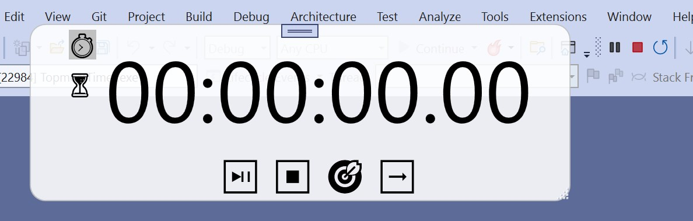

# Topmost Timer

A timer that always run on topmost of the desktop.  

This is a WPF core application for Windows.

## Features
* Both timer and countdown timer.
* Semi-Transparent window.

## License
* The MIT License (MIT)
* Copyright (C) 2022 Jason Wang